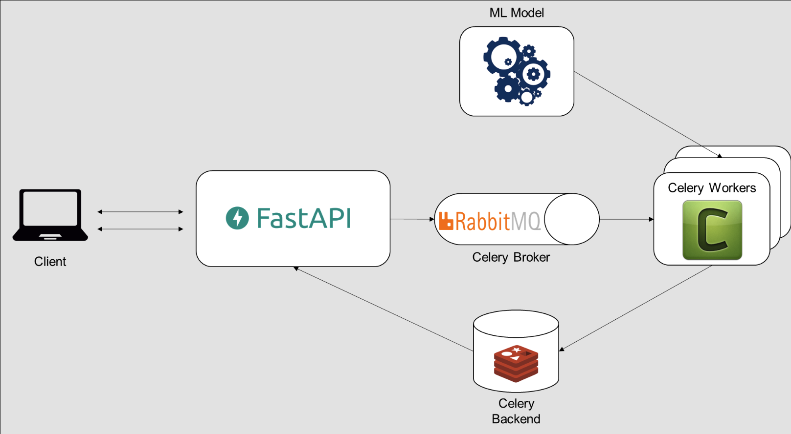

# VegasAir - Airline Booking Simulation

A full-stack application for airline booking simulation with dynamic pricing engine and machine learning-powered demand forecasting.

## Architecture



## Project Structure

```
vegasair/
├── backend/                 # FastAPI backend service
│   ├── api/                # API endpoints
│   ├── models/             # Database models
│   ├── services/           # Business logic
│   └── main.py            # FastAPI application entry point
├── frontend/               # Next.js frontend application
│   ├── app/               # Next.js app directory
│   │   ├── components/    # React components
│   │   ├── pages/        # Next.js pages
│   │   └── styles/       # CSS styles
│   └── public/           # Static assets
├── ml_server/             # Machine Learning service
│   ├── api_server.py     # FastAPI server for ML endpoints
│   └── run_ml_server.py  # Celery worker for ML tasks
├── scripts/               # Utility scripts
├── requirements.txt       # Python dependencies
├── .env.example          # Environment variables template
└── README.md             # Project documentation
```

## Features

- **Flight Management**
  - Flight scheduling and routing
  - Seat inventory management
  - Flight status tracking

- **Dynamic Pricing Engine**
  - Real-time price adjustments
  - Demand-based pricing
  - Competitive market analysis

- **Machine Learning Components**
  - Demand forecasting using multiple models (ARIMA, Prophet, LSTM)
  - Historical data analysis
  - Predictive analytics

- **Booking System**
  - Real-time seat availability
  - Secure payment processing
  - Booking confirmation and management

- **Modern Tech Stack**
  - FastAPI backend with PostgreSQL
  - Next.js frontend with React
  - Celery for ML task processing
  - Redis for task queue and caching

## Prerequisites

- Python 3.11+
- Node.js 18+
- PostgreSQL 14+
- Redis 6+

## Setup Instructions

1. **Clone the repository**
```bash
git clone https://github.com/yourusername/vegasair.git
cd vegasair
```

2. **Backend Setup**
```bash
# Create and activate virtual environment
python -m venv venv
source venv/bin/activate  # On Windows: venv\Scripts\activate

# Install Python dependencies
pip install -r requirements.txt

# Set up environment variables
cp .env.example .env
# Edit .env with your configuration
```

3. **Frontend Setup**
```bash
cd frontend
npm install
```

4. **Database Setup**
- Create a PostgreSQL database named 'vegasair'
- Update DATABASE_URL in .env file

5. **Redis Setup**
- Install and start Redis server
- Default configuration: localhost:6379

## Running the Application

1. **Start the Backend Server**
```bash
uvicorn backend.main:app --reload
```

2. **Start the ML Server**
```bash
# Terminal 1 - Start Celery worker
cd ml_server
python run_ml_server.py

# Terminal 2 - Start ML API server
python api_server.py
```

3. **Start the Frontend**
```bash
cd frontend
npm run dev
```

The application will be available at:
- Frontend: http://localhost:3000
- Backend API: http://localhost:8000
- ML Service: http://localhost:8001
- API Documentation: http://localhost:8000/docs

## API Documentation

- Backend API: http://localhost:8000/docs
- ML Service API: http://localhost:8001/docs

## Development

- Backend uses FastAPI with automatic OpenAPI documentation
- Frontend uses Next.js with React for modern UI development
- ML service uses Celery for distributed task processing
- All services communicate via REST APIs

## Testing

```bash
# Run backend tests
pytest

# Run frontend tests
cd frontend
npm test
```

## Contributing

1. Fork the repository
2. Create a feature branch
3. Commit your changes
4. Push to the branch
5. Create a Pull Request

## License

This project is licensed under the MIT License - see the LICENSE file for details. 